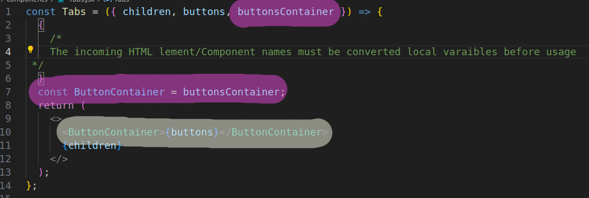

# REACT ESSENTIALS BY MAX

## 2023-11-12

### TEST: FORWARDING PROPS => FAILED

In this section the problem to be solved:
If we add **HTML attributes** to **custom elements**, these are **not forwarded** to our components.
For example:  
`<Section title="Examples" id="examples">`  
In this case the **id** is a simple hjtml attribut, and should be forwarded, to use ID assigned CSS.  
To let this happen, we need s pecial syntax in the target
component: Section:

`const Section = ({ title, children, ...props }) => {  `  
`/* ...props is a proxy props which forwarding the HTML   attributes of the caller component */`  
`  return (`  
`    <section {...props}>`  
`...`

This way the id attribute, and all othe attributes as well are transfered. This way we can transfer even `data-attribname` custom HTML elements as well, the only constraint is, that all character in the attrib must be LOWERCASE, else React sends error message.  
Besides `class`, and `style` can not be transferred, as they have React counterparts.

---

## 2023-11-12

### FORWARDING MULTIPLE SLOTS

In this section we had a problem in which we try to create a section element, which contained a 2 sub-elements:

1. a menu
2. a section with several divs shown the only one chosen by the active menu item

As we already sent the section as `children` prop, we can not use this.  
So we need a different solution, and for thiss, we just created the HTML content as a JSX variable,

`const buttons = (   `
`    <>`  
`      <TabButton isSelected={selectedTopic === "components"} onClick={() => handleSelect("components")}>`  
`        Components`  
`     </TabButton>`  
`      <TabButton isSelected={selectedTopic === "jsx"} onClick={() => handleSelect("jsx")}>`  
`        JSX`  
`      </TabButton>`  
`      <TabButton isSelected={selectedTopic === "props"} onClick={() => handleSelect("props>`  
`        Props`  
`      </TabButton>`  
`      <TabButton isSelected={selectedTopic === "state"} onClick={() => handleSelect("state")}>`  
`        State`  
`      </TabButton>`  
`    </>`  
` );`  
The component call:  
`<Tabs buttonsContainer="menu" buttons={buttons}>`  
 `{tabContent}`  
`</Tabs>`
Apart from this, the JSX popr can not be used instantly in the component. First it must be converted to a local contant, then this constan can be used as any other component:  

---
